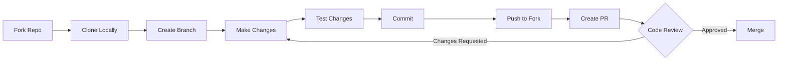

# Contributing to VishwaGuru 🌟

Thank you for your interest in contributing to **VishwaGuru**!  
This guide will help you set up the project locally and contribute effectively.

## 📑 Table of Contents
- [Development Workflow](#-development-workflow)
- [Getting Started](#-getting-started)
- [Setup Development Environment](#-setup-development-environment)
- [Running the Project](#-run-the-project)
- [Making Contributions](#-making-contributions)
- [Testing](#-testing)
- [Commit Guidelines](#-commit-guidelines)
- [Pull Request Process](#-pull-request-process)
- [Code Style Guidelines](#-code-style-guidelines)
- [Need Help?](#-need-help)

---

## 🔄 Development Workflow




## 📋 Getting Started

### 🔹 Prerequisites

Ensure you have the following installed:

- Python 3.12+
- Node.js 20+ and npm
- Git
- Telegram Bot Token (from @BotFather)
- Google Gemini API Key

---

## ⚙️ Setup Development Environment

### 1. Fork and Clone the Repository

Fork the repository from GitHub and clone it locally.

```bash
git clone https://github.com/YOUR_USERNAME/VishwaGuru.git
cd VishwaGuru
```

---

### 2. Add Upstream Repository

Add the main repository as upstream to keep your fork updated.

```bash
git remote add upstream https://github.com/RohanExploit/VishwaGuru.git
git fetch upstream
```

---

### 3. Create and Activate Virtual Environment

Create a Python virtual environment and activate it.

```bash
python -m venv venv
```

Windows
```bash
venv\Scripts\activate
```

Linux/Mac
```bash
source venv/bin/activate
```

---

### 4. Install Backend Dependencies

Install required Python packages.

```bash
pip install -r requirements.txt
```

---

### 5. Install Frontend Dependencies

Install required Node.js packages.

```bash
npm install
```

---

### 6. Environment Variables Setup

Create a `.env` file in the root directory and add your API keys.

> ⚠️ Never commit your `.env` file.

```bash
TELEGRAM_BOT_TOKEN=your_telegram_bot_token_here
GEMINI_API_KEY=your_gemini_api_key_here
```

---

## ▶️ Run the Project

Run backend and frontend services.

Backend
```bash
python main.py
```

Frontend
```bash
npm run dev
```

---

## 🌱 Creating a New Branch

Create a new branch before starting work.

```bash
git checkout -b feature/your-feature-name
```

---

## 🧪 Testing

Always test your changes before pushing to ensure everything works correctly.

### Backend Testing

```bash
# Run all tests
pytest backend/tests/

# Run with coverage report
pytest --cov=backend backend/tests/

# Run specific test file
pytest backend/tests/test_api.py

# Run specific test function
pytest backend/tests/test_api.py::test_create_issue
```

### Frontend Testing

```bash
cd frontend

# Run unit tests
npm test

# Run with coverage
npm run test:coverage

# Run in watch mode
npm run test:watch
```

### Manual Testing

1. **Start Backend**:
   ```bash
   python -m uvicorn backend.main:app --reload
   ```

2. **Start Frontend**:
   ```bash
   cd frontend && npm run dev
   ```

3. **Test Features**:
   - Create an issue via frontend
   - Test Telegram bot integration
   - Verify AI-generated responses
   - Check database persistence

### Pre-commit Checks

```bash
# Install pre-commit hooks (first time only)
pip install pre-commit
pre-commit install

# Run pre-commit checks manually
pre-commit run --all-files
```


## 📦 Commit Guidelines

Use meaningful commit messages.

Examples:
- `feat: add chatbot UI`
- `fix: resolve telegram webhook bug`
- `docs: update contributing guide`

```bash
git commit -m "feat: add Gemini API integration"
```

---

## 🔁 Sync with Upstream

Keep your fork updated before opening a PR.

```bash
git fetch upstream
git merge upstream/main
```

---

## 🚀 Pull Request Process

1. Push your branch to your fork.
2. Open a Pull Request against `main` branch.
3. Describe your changes clearly.
4. Attach screenshots if UI changes are made.

```bash
git push origin feature/your-feature-name
```

---

## 🐛 Reporting Issues

Include:
- Steps to reproduce
- Expected behavior
- Actual behavior
- Screenshots or logs

---

## 📚 Code Style Guidelines

- Follow PEP8 for Python
- Write clean and readable code
- Add comments for complex logic
- Use meaningful variable names

---

## 🤝 Code of Conduct

Be respectful and welcoming to all contributors.

---

## 💡 Need Help?

Open an issue or discussion here:  
https://github.com/RohanExploit/VishwaGuru
