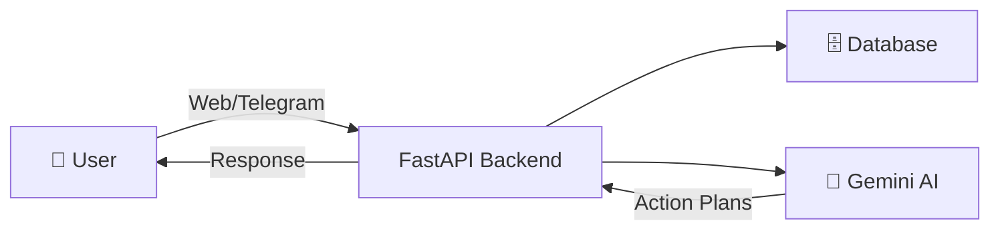

<div align="center">

# 🌟 VishwaGuru

### *Empowering India's Youth Through AI-Powered Civic Engagement*

[](https://www.gnu.org/licenses/agpl-3.0)
[](https://www.python.org/)
[](https://reactjs.org/)
[](https://fastapi.tiangolo.com/)
[](https://firebase.google.com/)

</div>

---

## 📖 About

VishwaGuru is an **open source platform** empowering India's youth to engage with democracy. It uses **AI** to simplify contacting representatives, filing grievances, and organizing community action. Built for India's languages and governance, it turns selfies and videos into real civic impact.

### 🎯 Mission

Making civic participation accessible, simple, and impactful for every Indian citizen through technology and AI.

## 📑 Table of Contents

- [✨ Features](#-features)
- [🏗️ Architecture & Data Flow](#️-architecture--data-flow)
- [📋 Prerequisites](#-prerequisites)
- [🚀 Installation](#-installation)
- [▶️ Running Locally](#️-running-locally)
- [☁️ Deployment to Firebase](#️-deployment-to-firebase)
- [🛠️ Tech Stack](#️-tech-stack)
- [👨‍💻 Development & Contribution Guide](#-development--contribution-guide)
- [📄 License](#-license)

---

## ✨ Features

<table>
<tr>
<td width="50%">

### 🤖 AI-Powered Action Plans
Generates WhatsApp messages and email drafts for civic issues using Google's Gemini API.

</td>
<td width="50%">

### 📢 Issue Reporting
Users can report issues via a web interface or a Telegram bot.

</td>
</tr>
<tr>
<td width="50%">

### 🔧 Local & Production Ready
Supports SQLite for local development and PostgreSQL for production.

</td>
<td width="50%">

### ⚡ Modern Stack
Built with React (Vite) and FastAPI for blazing fast performance.

</td>
</tr>
</table>

---

## 🏗️ Architecture & Data Flow

VishwaGuru uses a unified backend architecture where a single FastAPI service powers the web frontend, AI services, database operations, and the Telegram bot.

### 🔄 High-Level Flow



1. **📝 Submit**: Users submit civic issues via Web UI or Telegram
2. **🔍 Process**: Requests reach the FastAPI backend
3. **💾 Store**: Data is validated and stored in the database
4. **🧠 AI**: Backend sends data to Google Gemini when needed
5. **📬 Return**: AI-generated action plans are returned to users

### 🧩 Components Interaction

| Component | Technology | Purpose |
|-----------|-----------|---------|
| **Frontend** | React + Vite + Tailwind | User interface for web app |
| **Backend** | FastAPI + SQLAlchemy | API, logic, and orchestration |
| **Database** | SQLite/PostgreSQL | Stores civic issues and data |
| **AI Engine** | Google Gemini | Generates action plans |
| **Bot Interface** | Telegram Bot | Alternative user interface |

> 💡 **Note**: The Telegram Bot uses the same backend APIs as the web app for consistency.
---

## 📋 Prerequisites

Before you begin, ensure you have the following installed:

| Tool | Version | Purpose |
|------|---------|---------|
| 🐍 **Python** | 3.8+ | Backend runtime |
| 📦 **Node.js** | 18+ | Frontend build tool |
| 📚 **npm** | Latest | Package manager |
| 🔧 **Git** | Latest | Version control |

---

## 🚀 Installation

### 1️⃣ Clone the Repository

```bash
git clone <repository_url>
cd vishwaguru
```

### 2️⃣ Backend Setup

The backend handles API requests, database interactions, and the Telegram bot.

**Step 1:** Create a virtual environment (in the root directory):

<details>
<summary>🐧 Linux/macOS</summary>

```bash
python3 -m venv venv
source venv/bin/activate
```
</details>

<details>
<summary>🪟 Windows</summary>

```bash
python -m venv venv
venv\Scripts\activate
```
</details>

**Step 2:** Install dependencies:
```bash
pip install -r backend/requirements.txt
```

**Step 3:** Environment Configuration

Create a `.env` file in the root of the repository:

```bash
cp .env.example .env
```

Then edit `.env` to add your keys:

| Variable | Description | Required |
|----------|-------------|----------|
| `TELEGRAM_BOT_TOKEN` | Token from @BotFather | ✅ Yes |
| `GEMINI_API_KEY` | API Key from Google AI Studio | ✅ Yes |
| `DATABASE_URL` | PostgreSQL connection string | ⚠️ Optional (defaults to SQLite) |

> 🔐 **Security Note**: Never commit API keys or secrets to version control!

### 3️⃣ Frontend Setup

The frontend is a React application built with Vite.

**Step 1:** Navigate to the frontend directory:

```bash
cd frontend
```

**Step 2:** Install dependencies:

```bash
npm install
```

---

## ▶️ Running Locally

### 🔙 Start the Backend Server

From the **root directory** (with your virtual environment activated):

```bash
PYTHONPATH=backend python -m uvicorn main:app --reload
```

✅ The API will be available at **`http://localhost:8000`**

> 🪟 **Windows users**: Use `set PYTHONPATH=backend & python -m uvicorn main:app --reload`

### 🎨 Start the Frontend Development Server

Open a new terminal window:

```bash
cd frontend
npm run dev
```

✅ The application will be accessible at **`http://localhost:5173`**

### 🤖 Start the Telegram Bot

The Telegram bot runs as part of the FastAPI application lifecycle, so it **starts automatically** when you run the backend server.

---

## ☁️ Deployment to Firebase

VishwaGuru can be deployed fullstack on Firebase using **Firebase Hosting** (frontend) and **Cloud Functions** (backend).

### 📦 Prerequisites

1. **Install Firebase CLI:**
   ```bash
   npm install -g firebase-tools
   ```

2. **Login to Firebase:**
   ```bash
   firebase login
   ```

### 🚢 Deployment Steps

<details>
<summary><strong>Step 1: Initialize Project</strong></summary>

```bash
firebase init
```

- Select **Hosting** and **Functions**
- Choose "Use an existing project" or create a new one
- Select **Python** for Functions language

> 💡 The project is already configured with `firebase.json` and `.firebaserc`. You can skip initialization and just set the project alias:

```bash
firebase use --add
```
</details>

<details>
<summary><strong>Step 2: Build Frontend</strong></summary>

```bash
cd frontend
npm run build
cd ..
```
</details>

<details>
<summary><strong>Step 3: Deploy</strong></summary>

```bash
firebase deploy
```

This command will:
- ✅ Build the functions source
- ✅ Deploy the backend as a Firebase Cloud Function (Gen 2)
- ✅ Deploy the frontend to Firebase Hosting
- ✅ Set up rewrites for API routing
</details>

### 🔐 Environment Variables

For Cloud Functions (Gen 2), create a `functions/.env` file before deploying:

```env
TELEGRAM_BOT_TOKEN=your_token_here
GEMINI_API_KEY=your_key_here
DATABASE_URL=your_postgres_url_here
```

> ⚠️ **Important**: DO NOT COMMIT THIS FILE! Add it to `.gitignore`

<details>
<summary>Alternative: Firebase Gen 1 Config (Legacy)</summary>

```bash
firebase functions:config:set \
  app.telegram_bot_token="YOUR_TOKEN" \
  app.gemini_api_key="YOUR_KEY" \
  app.database_url="YOUR_POSTGRES_URL"
```
</details>

---

## 🛠️ Tech Stack

<table>
<tr>
<td align="center" width="33%">

### 🎨 Frontend


</td>
<td align="center" width="33%">

### ⚙️ Backend


</td>
<td align="center" width="33%">

### 🗄️ Database


</td>
</tr>
<tr>
<td align="center" width="33%">

### 🤖 AI & Bot


</td>
<td align="center" width="33%">

### ☁️ Deployment


</td>
<td align="center" width="33%">

### 🔧 Tools


</td>
</tr>
</table>

---

## 👨‍💻 Development & Contribution Guide

This section helps new contributors and developers understand how to work with the VishwaGuru codebase effectively.

### 🔄 Development Workflow


1. **🍴 Fork** the repository
2. **🌿 Create** a new branch from `main`
3. **✏️ Make** focused changes related to a single issue
4. **🧪 Test** changes locally
5. **📤 Open** a pull request with a clear description

### 📡 API Usage Overview

- The frontend communicates with the backend using **REST APIs**
- Issue submissions are sent from the frontend to the **FastAPI backend**
- The backend handles **validation**, **database storage**, and **AI integration**
- Responses are returned as **JSON** and rendered in the UI
- The same backend APIs are used by the **Telegram bot**

> 💡 This unified API design ensures consistent behavior across all user interfaces.

### 🔐 Environment Configuration Tips

- ✅ Use `.env` files for local development
- ❌ Never commit API keys or secrets
- ⚙️ Ensure `DATABASE_URL` is set correctly when switching between SQLite and PostgreSQL

### ⌨️ Common Development Commands

<table>
<tr>
<td width="50%">

#### 🔙 Backend

```bash
# Activate virtual environment
source venv/bin/activate  # Linux/macOS
# or
venv\Scripts\activate     # Windows

# Start backend server
PYTHONPATH=backend python -m uvicorn main:app --reload
```

</td>
<td width="50%">

#### 🎨 Frontend

```bash
# Navigate to frontend
cd frontend

# Install dependencies
npm install

# Start dev server
npm run dev

# Build for production
npm run build
```

</td>
</tr>
</table>

---

## 🤝 Contributing

We welcome contributions from the community! Here's how you can help:

1. 🐛 **Report bugs** by opening an issue
2. 💡 **Suggest features** or enhancements
3. 📝 **Improve documentation**
4. 🔧 **Submit pull requests**

Please read our [Contributing Guidelines](CONTRIBUTING.md) before submitting a PR.

### 📜 Code of Conduct

Please review our [Code of Conduct](CODE_OF_CODUCT.md) before participating in this project.

---

## 📄 License

This project is licensed under the **GNU Affero General Public License v3.0 (AGPL-3.0)**.

See the [LICENSE](LICENSE) file for details.

---

<div align="center">

### 🌟 Star us on GitHub — it motivates us a lot!

Made with ❤️ for India's democracy

[Report Bug](../../issues) · [Request Feature](../../issues) · [Join Discussion](../../discussions)

</div>
